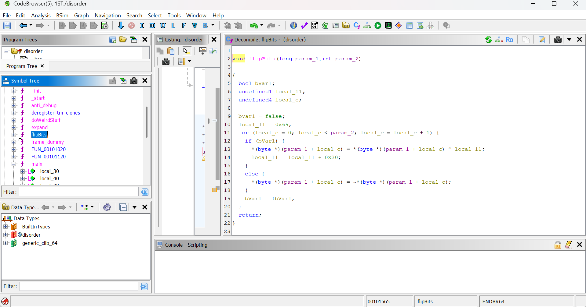
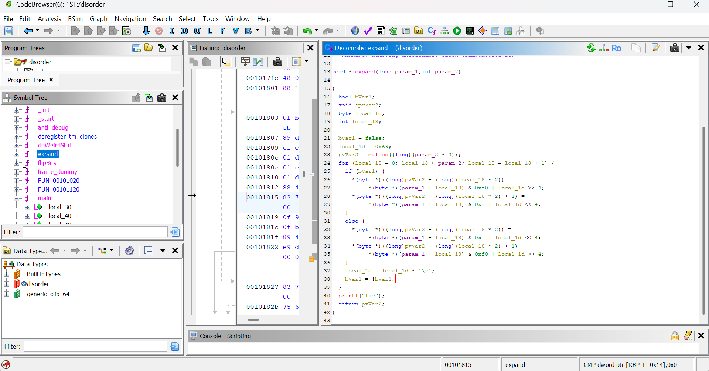
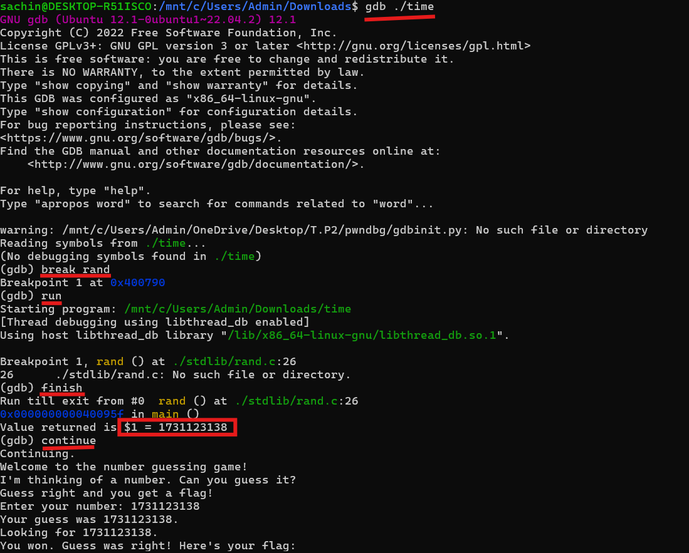

# 1.JoyDivision

This challenge hides the real flag by scrambling a text file through a flip-bit routine and three layers of an expand function that shreds each byte into smaller mixed pieces.The task is to reverse all these transformations in the correct order and recover the original flag from the heavily scrambled output.

## Solution:

I started by putting the binary and its files together in one folder and opening it in Ghidra. At first glance the program looked noisy because it was printing Roman quotes and calling a few helper functions but when I went through main slowly it became clear that the entire logic was just built around reading a file and scrambling it in a very systematic way.


The file it actually cared about was palatinepackflag.txt. That was the original secret. The program never printed this file directly. Instead it applied two transformations in a strict order: first flipBits and then expand three times. And finally it printed the fully scrambled result and saved it in flag.txt. So I understood pretty quickly that whatever is in flag.txt is not the real flag. It’s the flag after going through four layers of scrambling.


At this point my thought was simple: if the program scrambled it step by step then all I need to do is undo the same steps in the opposite direction. So the focus shifted to figuring out exactly what flipBits does and what expand does because once I knew that reversing them would basically give me the original flag.


### flipBits



I checked flipBits first since it was shorter. The idea behind flipBits is very direct. It walks through the bytes one by one. The first byte gets inverted bitwise. The second one gets XORed with a key. The third one gets inverted again. Fourth gets XOR again. And so on. It alternates between invert and xor and meanwhile the key also keeps changing a bit every time it hits the xor case.


Because invert and xor are both reversible and because it alternates in a fixed predictable way this immediately told me something useful. If I apply the exact same flipBits logic again to already flipped bytes I will get the original bytes. So flipBits is self inverse. That was nice because it meant the last step of my solution would be very easy.


### expand



Then I looked at expand. This was the real heart of the scrambling. expand takes every single byte and breaks it into two bytes by mixing half of the original byte with half from a time-varying key. The key changes every step and also the pattern keeps switching. The first byte uses one pattern. The second uses the opposite pattern. Then it switches again. So for every original byte expand spits out two scrambled bytes.


That meant expand doubles the size every time it runs. And since the program was calling expand three times the size of the buffer got multiplied by eight. That also explained why the final output looked like pure garbage. Each layer was shredding the information into smaller and smaller fragments.


But the important thing was that expand never actually destroys information. It only rearranges the high nibble and low nibble and replaces the missing halves with predictable key halves. Since all of this is reversible I wrote a version that simply takes two bytes from the final output and reconstructs the original one. I repeated that until I undid all three expand layers and the data finally shrank back to its true length.


Putting it together:


Once I had the reversing functions ready the decoding path was very simple in my mind


1.read flag.txt


2.reverse expand three times


3.undo flipBits once


4.print the result


That’s all the challenge wanted. The final script ended up being very short because both reverse_expand and unflip were direct inverses of the original functions. The script :

```
def rev_expand(b):
    o=bytearray(len(b)//2);k=0x69;f=0
    for i in range(len(o)):
        a,c=b[2*i],b[2*i+1]
        o[i]=(c&0xF0)|(a&0x0F) if not f else (a&0xF0)|(c&0x0F)
        k=(k*11)&255;f^=1
    return bytes(o)

def unflip(b):
    o=bytearray(len(b));k=0x69;f=0
    for i in range(len(b)):
        o[i]=(~b[i])&255 if not f else b[i]^k
        if f:k=(k+32)&255
        f^=1
    return bytes(o)

d=open("flag.txt","rb").read()
for _ in range(3):d=rev_expand(d)
print(unflip(d).decode("latin1"))
```

Running this gave me the original hidden flag

## Flag:

```
sunshine{C3A5ER_CR055ED_TH3_RUB1C0N}
```

## Concepts learnt:

The main thing I took away from this challenge was how small reversible transformations can be stacked to make the final output look totally unreadable. But if each layer is invertible and if the order is known then the entire thing becomes a matter of patiently walking backward. I also got a better feel for nibble mixing and how alternating patterns create a kind of fake noise while still remaining perfectly reversible.

## Incorrect Tangents

1.I initially tried to search for the flag directly inside the binary using the strings panel in Ghidra, assuming maybe the original text was hard-coded somewhere. It wasn’t, so that didn’t lead anywhere.


2.I got distracted by anti_debug, expecting it to kill execution or alter values if a debugger was detected. I checked its behavior, only to realize the output of main didn’t depend on it at all.

3.At one point I tried to undo flipBits manually by writing out the XOR and invert operations byte by byte. Later I remembered that the function is self-inverse, so running the same thing again automatically fixes everything.


## Resources:

https://github.com/NationalSecurityAgency/ghidra
***

# 2.worthy.knight

The challenge is a reverse engineering puzzle where a 10-character incantation must satisfy a mix of XOR rules and an MD5 hash check. We have to analyze the binary to extract constraints for each character pair and reconstruct the correct input to reveal the flag.


## Solution:

I started by opening the binary in Ghidra.
The entry function didn’t do anything interesting — it just called __libc_start_main with a function pointer. So I followed that and landed inside the main logic, which was labeled something like FUN_001010d0.


Once I was inside that function, the flow became clear. The program printed an ASCII knight scene and then asked for a 10‑character incantation. After that it checked the input in pairs of two characters. So I knew I would be solving for 5 separate pairs.


Each pair had some conditions, and most were simple XOR checks.


Pair 1


Ghidra showed:


second char must be 'j'


(c1 ^ c0) == 0x24


So I solved the XOR:
```
p1 = chr(ord('j')^0x24) + 'j'   # gives "Nj"
```

Pair 2


Exact same structure:


second char 'S'


(c2 ^ c3) == 0x38


So:

```
p2 = chr(ord('S')^0x38) + 'S'   # "kS"
```

Pair 4


Same pattern:

```
p4 = chr(ord('a')^0x38) + 'a'   # "Ya"
```

Pair 5


Again same logic:

```
p5 = chr(ord('i')^0x20) + 'i'   # "Ii"
```

By this point I already had 4 pairs just by reading the conditions in Ghidra and undoing the XOR.


Pair 3 — the only non‑trivial part


When I reached this section in Ghidra, the code looked different.
Instead of an XOR rule, it created a two‑byte buffer using the 3rd pair and computed an MD5 hash. Then it compared it to this constant:


33a3192ba92b5a4803c9a9ed70ea5a9c


It also enforced that the characters had to be mixed case (one upper, one lower) due to the _ctype_ bitmask checks.


At this point it was clear that brute‑forcing the pair was the easiest way.
So I wrote a small script that tries every letter pair.
```
import hashlib

letters = "abcdefghijklmnopqrstuvwxyzABCDEFGHIJKLMNOPQRSTUVWXYZ"

target = "33a3192ba92b5a4803c9a9ed70ea5a9c"
for a in letters:
    for b in letters:
        if a.islower() != b.islower():      
            if hashlib.md5((b+a).encode()).hexdigest() == target:
                p3 = a+b                  
                break
    else:
        continue
    break
```

This successfully found:


fT


So pair 3 is "fT".


Putting everything together

Finally I joined all five pairs:
```
print("KCTF{"+p1+p2+p3+p4+p5+"}")
```

### FINAL SCRIPT

```
import hashlib

letters = "abcdefghijklmnopqrstuvwxyzABCDEFGHIJKLMNOPQRSTUVWXYZ"

p1 = chr(ord('j')^0x24)+'j'
p2 = chr(ord('S')^0x38)+'S'
p4 = chr(ord('a')^0x38)+'a'
p5 = chr(ord('i')^0x20)+'i'

target = "33a3192ba92b5a4803c9a9ed70ea5a9c"
for a in letters:
    for b in letters:
        if a.islower() != b.islower():
            if hashlib.md5((b+a).encode()).hexdigest() == target:
                p3 = a+b
                break
    else:
        continue
    break

print("INPUTIS{"+p1+p2+p3+p4+p5+"}")
```
I put this in the prog and got my flag


## Flag:

```
KCTF{NjkSfTYaIi}
```

## Concepts learnt:
1.XOR-based pair checks:Some binaries validate input using XOR between two characters, Reverse engineering these checks lets you compute one character from the other easily.


2.MD5-based validation in memory:A program can compute a hash of part of the input and compare it to a constant, Brute-forcing or scripting is an efficient way to satisfy such hash checks.

## Incorrect Tangents

 1.Assuming sequential ASCII or random guessing: Without looking at XOR and MD5 rules, guessing characters sequentially usually fails, Pair 3 can’t be solved by ASCII logic alone because it’s hash-checked.


 2.Assuming all pairs have XOR checks: Pair 3 does not use XOR at all; it uses MD5, Treating all pairs as XOR-checked could mislead you and waste time.

## Resources:
https://www.geeksforgeeks.org/computer-networks/what-is-the-md5-algorithm/


https://www.md5hashgenerator.com/  (used for confirming)

***

# 3. time

A simple number-guessing binary that uses srand(time) and a single rand() call, making the “secret” predictable by breaking on rand in gdb.

## Solution:
This challenge looked like a normal number-guessing game but when I opened the file in Ghidra the whole thing became very straightforward. The program wasn’t choosing a real random number at all.

I started by reading the main function in Ghidra. The only important lines were these:

```
tVar1 = time(0)
srand(tVar1)
local_14 = rand()
```

The moment I saw this I kinda knew what the trick was. The program takes the current time, uses it as the seed, and then calls rand() once. So the “secret number” is literally just whatever rand() returns the first time.

My thought was basically:
why try to guess the number when I can just stop the program right when rand() runs and look at what value it returns.

So I opened it in gdb:
```
gdb ./time
```

Then I set a breakpoint on the rand function itself:
```
break rand
run
```

The program stopped exactly when rand was called.
Then I used:
```
finish
```

This makes gdb run the rest of the rand function and show me the return value.
That return value is the secret number the game wants me to guess.

After that I typed:
```
continue
```

Then the program asked me to “Enter your number”.
I simply typed the same number I saw in gdb.
 
The check passed and the flag printed.


My whole thinking was very simple:

the program uses time() as seed ---> the seed is predictable ---> only one call to rand is made ---> so just break on rand and steal the number directly

## Flag:

```
NO FLAG ONLY CONFIRMATION
```

## Concepts learnt:

1.Rand() becomes predictable if seeded with time()

2.Breaking on library functions like rand is super effective

3.Finish shows the returned value of the function

## Incorrect Tangents

I briefly thought maybe the number needed brute forcing but gdb removed all the difficulty instantly

## Resources:
https://www.geeksforgeeks.org/linux-unix/gdb-command-in-linux-with-examples/

***

# 4.VeridisQuo

This time I had to reverse engineer an Android APK called VeridisQuo. The goal was simple find the flag.

## Solution:

First I needed a tool that can break an APK into readable files like xml and smali.

So I installed apktool:
```
sudo apt install apktool
```
this was necessary as just unzipping an apk is not enough. apktool gives me the layout files and smali code which I must read to find hidden text.

Next would be to Decompile the APK
```
apktool d VeridisQuo.apk -o VeridisQuo_dec
```

This gave me a folder named VeridisQuo_dec. Doing this was pretty obvious as I needed to see what is inside the app. Decompiling is always the first step in Android reverse engineering.

Next i looked inside the folder
```
ls VeridisQuo_dec
```

I saw files like:
```
AndroidManifest.xml

res

smali
```
Further I focused on AndroidManifest.xml which tells me which activity starts first. To understand the app, I must start from the entry point, just like following the main() in a normal program. Once opened I found:
```
<activity android:name="byuctf.downwiththefrench.MainActivity">
    <intent-filter>
        <action android:name="android.intent.action.MAIN"/>
        <category android:name="android.intent.category.LAUNCHER"/>
    </intent-filter>
</activity>
```

here the activity filter is so significant because The activity with MAIN and LAUNCHER is the first screen of the app.
So I must check this MainActivity next.

I also noticed the package name starts with byuctf, which might be part of the flag.

Next step would be to Check MainActivity.smali
```
"C:\Users\Admin\Downloads\VeridisQuo_dec\smali_classes3\byuctf\downwiththefrench\MainActivity.smali"
```
I opened it:

Inside I saw:
```
invoke-virtual {v0}, Lbyuctf/downwiththefrench/Utilities;->cleanUp()V
```
Why this matters
The name "cleanUp" looked suspicious.
It felt like something was being deleted or hidden when the app starts.
So the next logical step was to see what this cleanUp function does so I opened Utilities.smali 

```"C:\Users\Admin\Downloads\VeridisQuo_dec\smali_classes3\byuctf\downwiththefrench\Utilities.smali"
```

Inside it, I saw that cleanUp() finds many TextViews named:

flagPart1, flagPart2, ..., flagPart28

and sets their text to empty.

This confirmed that the app hides something on purpose.
So if the app clears the text at runtime, the original text must still exist inside the layout xml file.

so I opened the layout xml file:

Inside I saw 28 TextViews:

flagPart1  -> "}"

flagPart2  -> "t"

flagPart3  -> "a"

...

flagPart28 -> "{"


These TextViews hold the actual flag characters.
The cleanUp() function only removed them when the app runs, but apktool shows the original values.

So I wrote down all characters in order.

Flag parts in order gave me:

} t a y c c d r n i 0 d k u p o c f e _ e _ f i _ 4 e {

i.e 

}tayccdrni0dkupocfe_e_fi_4e{


This is clearly reversed at the borders.
So the inner part becomes:

e4_if_e_efcopukd0inrdccyat

Step 9 — Add the correct prefix

Since the package name was:

byuctf.downwiththefrench


and BYUCTF uses flags like:

byuctf{...}


I placed the inside text into the braces:

byuctf{e4_if_e_efcopukd0inrdccyat}


This fits perfectly.
## Flag:

```
byuctf{e4_if_e_efcopukd0inrdccyat}
```

## Concepts learnt:
1.How Android apps store UI data in XML:

I learned that TextViews in the layout XML often contain important static text, and smali code can modify or erase it when the app runs. This helps in locating hidden information like flags before the code clears it.

2.How to trace app behavior through Manifest → Activity → smali

I understood how to follow the flow of an Android app: start at the manifest to find the entry activity, read the smali code for that activity, and then inspect helper classes and functions to see how they manipulate data.


## Incorrect Tangents

1.Initially assuming the flag would appear in the Java/smali logic

I first expected the flag to be hidden in some encryption or computation, but the code only erased the flag instead of generating it. The real flag was sitting in the XML, not the smali.

2.Thinking cleanUp() might construct the flag

When I saw a function called cleanUp(), I thought it might process or build parts of the flag, but it actually did the opposite—it just deleted the visible flag pieces. This helped me refocus on checking the static layout files.

## Resources:

https://youtu.be/KXP0eKaMjro?si=tWPEN8FW2UPSr0L0


***

# 5.Dusty

This challenge hides the flag inside a byte array and simply XOR-encodes each byte with a fixed key.
All you have to do is extract those bytes and reverse the XOR to recover the original flag.

## Solution:
I started by opening the binary in Ghidra, and the first thing that caught my eye was that the main function wasn’t doing anything interesting itself. Instead, everything was inside a Rust function called shinyclean::main. So I jumped straight into that.

My plan was simple: find where the flag is being built.
When I started scrolling through the decompiled output, I noticed two arrays:

local_de → this was initially filled with zeros

local_c7 → this one already contained some fixed bytes

That immediately made me think: OK, so probably the encrypted bytes of the flag are in local_c7.

Then I saw this line:

local_de[local_b0] = local_c7[local_b0] ^ 0x3f;


The moment I saw the XOR with a constant key (0x3f), everything clicked.
This was definitely the decryption step.
So basically each byte of the final flag = each byte of c7 XOR 0x3f.

 I copied local_c7 into a Python list and just XOR’ed everything with 0x3f.
My script looked like this:

```
c7 = [
    0x7b, 0x5e, 0x48, 0x58, 0x7c, 0x6b, 0x79, 0x44, 0x79, 0x6d, 
    0x0c, 0x0c, 0x60, 0x7c, 0x0b, 0x6d, 0x60, 0x68, 0x0b, 0x0a, 
    0x77, 0x1e, 0x42
]

flag = ""
for b in c7:
    flag += chr(b ^ 0x3f)
print(flag)
```

I ran it, and it cleanly printed the entire flag in one go.
So the challenge ended up being extremely straightforward once I noticed the XOR loop inside Ghidra.

## Flag:

```
DawgCTF{FR33_C4R_W45H!}
```

## Concepts learnt:

1.I understood how Rust binaries often look inside Ghidra — a lot of noise from formatting functions, but the actual logic is usually clean and visible once you scroll past the wrappers.

2.XOR-based “encryption” is extremely common in CTF binaries. If you see a XOR with a constant key inside a loop, it almost always means: just invert it with the same XOR.

## Incorrect Tangents

I initially tried to check whether there were extra operations before local_de[local_b0], but there wasn’t. I almost overthought it by looking for some kind of two-step encryption, but the XOR was the only operation.


## Resources:

https://github.com/NationalSecurityAgency/ghidra
***