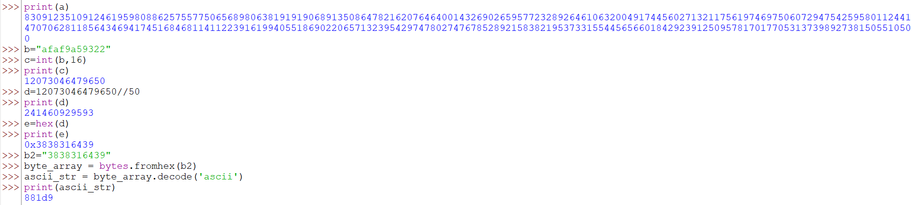

# 1.Rsa_Oracle

Can you abuse the oracle?
An attacker was able to intercept communications between a bank and a fintech company. They managed to get the message (ciphertext) and the password that was used to encrypt the message.
Additional details will be available after launching your challenge instance.

## Solution:

I started by downloading the files into a folder and changing into it in WSL:

```
cd /mnt/c/Users/Admin/OneDrive/Desktop/T.P2
```


Then I opened the picoCTF oracle with 
```
nc titan.picoctf.net 65158
```
The challenge description said the oracle could encrypt the password but would not let us decrypt it directly. That made me think: if I can’t just ask the oracle to decrypt the password, can I trick it into revealing information that lets me recover the password?

 The oracle will encrypt or decrypt numbers under RSA, and RSA has the multiplicative property: if c1 = m1^e mod n and c2 = m2^e mod n, then c1 * c2 mod n equals (m1*m2)^e mod n. So my plan was to create a value of my own, encrypt it with the oracle, multiply that ciphertext with the password’s ciphertext, then ask the oracle to decrypt the product. The oracle would return a plaintext equal to the product of the two messages, and from that I could recover the original password.

Concretely, I chose a small value — the character '2'. The ASCII code for '2' is 0x32, which equals decimal 50. I had the oracle encrypt that value and it returned a large ciphertext. Then I multiplied that ciphertext with the ciphertext for the password (which I had in password.enc). Because of RSA math this gave me the ciphertext for 50 * password (i.e. (50 * password)^e mod n)


Next I asked the oracle to decrypt the multiplied ciphertext. The oracle returned a hex string. I converted that hex to an integer so I could do arithmetic on it. After reversing the multiplication — I divided by 50 (general way is to use the modular inverse (written as s⁻¹ mod n) to undo the multiplication.)in my worked example and converted the result back to hex then to ASCII — I got the original password.

The final step was to use that password to decrypt secret.enc with openssl (the challenge hint explicitly suggested openssl). After decrypting with the recovered key I obtained the flag.
```
sachin@DESKTOP-R51ISCO:/mnt/c/Users/Admin/OneDrive/Desktop/T.P2$ nc titan.picoctf.net 65158
*****************************************
****************THE ORACLE***************
*****************************************
what should we do for you?
E --> encrypt D --> decrypt.
E
enter text to encrypt (encoded length must be less than keysize): 2
2

encoded cleartext as Hex m: 32

ciphertext (m ^ e mod n) 4707619883686427763240856106433203231481313994680729548861877810439954027216515481620077982254465432294427487895036699854948548980054737181231034760249505

what should we do for you?
E --> encrypt D --> decrypt.
D
Enter text to decrypt: 8309123510912461959808862575577506568980638191919068913508647821620764640014326902659577232892646106320049174456027132117561974697506072947542595801124414707062811856434694174516846811411223916199405518690220657132395429747802747678528921583821953733155445656601842923912509578170177053137398927381505510500
decrypted ciphertext as hex (c ^ d mod n): afaf9a59322
decrypted ciphertext:
úù¥"

what should we do for you?
E --> encrypt D --> decrypt.
^C
sachin@DESKTOP-R51ISCO:/mnt/c/Users/Admin/OneDrive/Desktop/T.P2$ openssl enc -aes-256-cbc -d -in secret.enc -k 881d9
*** WARNING : deprecated key derivation used.
Using -iter or -pbkdf2 would be better.
picoCTF{su((3ss_(r@ck1ng_r3@_881d93b6}

```


## Flag:

```
picoCTF{su((3ss_(r@ck1ng_r3@_881d93b6}
```

## Concepts learnt:
Main thing I  learnt was what a cipher is, types of cipher and mainly assymetrical cipher RSA--
RSA is a type of encryption used to keep data safe. It works using two keys — one public key (which everyone can see) and one private key (which only the owner knows).

The public key is used to encrypt a message, and only the private key can decrypt it. It is based on the fact that multiplying two big prime numbers is easy, but finding those prime numbers again from their product is very hard.
also learnt about maths behind RSA.


## Incorrect Tangents

1.I was trying to divide the decrypted product by 2 instead of 50, but then I realized that wasn’t how the oracle was working. When I entered 2, it actually took the hex value 0x32 and converted it to decimal 50. So what the oracle was really encrypting wasn’t 2, but 50.

2.At first, I tried to decrypt the contents of password.enc directly by putting it into the oracle, but the oracle didn’t return anything. When I got stuck, I even tried decrypting the contents of secret.enc with the oracle, even though it was meant only for the password.

## Resources:

https://youtu.be/hm8s6FAc4pg?si=pj9KwL11DBvfGd-y
https://ctf101.org/cryptography/overview/


***

# 2. Custom encryption

Can you get sense of this code file and write the function that will decode the given encrypted file content.
Find the encrypted file here flag_info and code file might be good to analyze and get the flag.

## Solution:

I started by downloading the files into a folder and changing into it in WSL:

```
cd /mnt/c/Users/Admin/OneDrive/Desktop/T.P2
```
Then I began to analyze the code file. I read through the code line by line. There were mainly two functions doing the job. First, the function dynamic_xor_encrypt() was reversing the message being input as an argument and then it was using the XOR cipher. Then, the output of this function was being passed into another function which was further changing things in it. The function was:
encrypt()
Now, to make a decrypt function that would decrypt the content given in the enc_file, what I had to do was something similar to reverse engineering. I felt I had to undo the changes made by both functions, starting from the encrypt function. What this function was actually doing was really simple:

```
def encrypt(plaintext, key):
    cipher = []
    for char in plaintext:
        cipher.append(((ord(char) * key*311)))
    return cipher
 ```
cIt converts the characters into numbers from ASCII and then multiplies them by (key311). To reverse it, I just had to divide the numbers in my ciphered content by (key311) and then convert them back to ASCII. But before that, we had to find the key. The key is basically found in the test function: 
```
def test(plain_text, text_key):
    p = 97
    g = 31
    if not is_prime(p) and not is_prime(g):
        print("Enter prime numbers")
        return
    a = 90
    b = 26
    print(f"a = {a}")
    print(f"b = {b}")
    u = generator(g, a, p)
    v = generator(g, b, p)
    key = generator(v, a, p)
    b_key = generator(u, b, p)
    print("this is the b_key:",b_key)
    print("this is the key:",key)
    shared_key = None
    if key == b_key:
        shared_key = key
    else:
        print("Invalid key")
        return
    semi_cipher = dynamic_xor_encrypt(plain_text, text_key)
    cipher = encrypt(semi_cipher, shared_key)
    print(f'cipher is: {cipher}')
```
out of all this we get the idea what is the key from these simple lines:
```
if key == b_key:
        shared_key = key
```
So what I did was just write a print statement after b_key was generated (notice in the above function). So now I had the key too, which was 22. (Also, I had to make the values of a = 90 and b = 26 permanent to find the required key.) So now I was halfway done:
(the actual function I wrote in Python till this part)
```
def decrypt():
    cipher2=[61578, 109472, 437888, 6842, 0, 20526, 129998, 526834, 478940, 287364, 0, 567886, 143682, 34210, 465256, 0, 150524, 588412, 6842, 424204, 164208, 184734, 41052, 41052, 116314, 41052, 177892, 348942, 218944, 335258, 177892, 47894, 82104, 116314]
    cipher_new=[]
    cipher_100=[]
    for i in cipher2:
        
        cipher_new.append(i/(22*311))
    print(cipher_new)    
    for j in cipher_new:
        cipher_100.append(chr(int(j)))
    print("\n good work",cipher_100)
    half_done = ''.join(cipher_100)
```
At last, I also converted the list (which came after undoing the changes) into a proper string (half_done). The next step was to XOR it again (XOR is reversible). After doing XOR, the last step I did was reversing the string (I remembered that in the dynamic_xor_encrypt function, what first happened was that the plain_text was reversed). This finally gave me my original argument.
For this purpose, I wrote another function dynamic_xor_deencrypt inside my decrypt function and then called it. So my final decrypt function was:
```
def decrypt():
    cipher2=[61578, 109472, 437888, 6842, 0, 20526, 129998, 526834, 478940, 287364, 0, 567886, 143682, 34210, 465256, 0, 150524, 588412, 6842, 424204, 164208, 184734, 41052, 41052, 116314, 41052, 177892, 348942, 218944, 335258, 177892, 47894, 82104, 116314]
    cipher_new=[]
    cipher_100=[]
    for i in cipher2:
        
        cipher_new.append(i/(22*311))
    print(cipher_new)    
    for j in cipher_new:
        cipher_100.append(chr(int(j)))
    print("\n good work",cipher_100)
    half_done = ''.join(cipher_100)
    def dynamic_xor_deencrypt():
        plaintext=half_done
        text_key="trudeau"
        deciphered_text = ""
        key_length = len(text_key)
        for i, char in enumerate(plaintext):
            key_char = text_key[i % key_length]
            deencrypted_char = chr(ord(char) ^ ord(key_char))
            deciphered_text += deencrypted_char
        print(deciphered_text[::-1]) 
    dynamic_xor_deencrypt()
```
following was the output of the above function:
```python
 good work ['\t', '\x10', '@', '\x01', '\x00', '\x03', '\x13', 'M', 'F', '*', '\x00', 'S', '\x15', '\x05', 'D', '\x00', '\x16', 'V', '\x01', '>', '\x18', '\x1b', '\x06', '\x06', '\x11', '\x06', '\x1a', '3', ' ', '1', '\x1a', '\x07', '\x0c', '\x11']
picoCTF{custom_d2cr0pt6d_49fbee5b}
```

## Flag:

```
picoCTF{custom_d2cr0pt6d_49fbee5b}
```

## Concepts learnt:
Learned about XOR cipher and how does it work:
The XOR cipher is a simple way to hide a message using the XOR (exclusive OR(the logic gate)) operation.

You take each letter (or byte) of your message and XOR it with a key.
This changes the message into unreadable text.
To get the original message back, you just XOR it again with the same key — it reverses itself.


## Incorrect Tangents

The major incorrect tangents I went on was trying to reverse X0R function by indoing each line of syntax one by one instead of just realizing that I could just use this same function and X0R again to get the desired result.
Other mistakes were mainly related to syntax and all.

## Resources:

https://www.youtube.com/watch?v=pvII6_O6KAc

***

# 3. miniRSA

Let's decrypt this: ciphertext? Something seems a bit small.

## Solution:
I started by downloading the files into a folder and changing into it in WSL:

```
cd /mnt/c/Users/Admin/OneDrive/Desktop/T.P2
```
n the contents of the downloaded file, N, e, and the ciphertext were given. It was also repeated several times in the hints of the challenge that e is very small.
I knew a bit of the math behind RSA:

cipher = (message^e) mod n


So when e is very small (like in this case, 3), then the message can simply be found by taking

message = cipher^(1/3)


because message³ would be smaller than n.

But if the message itself is a bit larger, then we need to try the following:

message = (cipher + k*n)^(1/3)


where k = 0, 1, 2, 3...

Now I focused on what I already had and what I needed to find.
I had cipher, n, and I knew e = 3.
So the remaining part was just the calculation, which I decided to do using a Python script.

The first step was to take the cube root of my ciphered content (which is a very big number).
Doing a cube root in Python for normal numbers is fine, but when it comes to very large numbers, there’s a chance of overflow or inaccuracy.
So I wrote a separate function for finding the integer cube root using a binary search approach:
```
def integer_cuberoot(n):
    """Return the integer cube root of n (largest integer r such that r**3 <= n)"""
    low = 0
    high = n
    while low <= high:
        mid = (low + high) // 2
        mid_cubed = mid**3
        if mid_cubed == n:
            return mid
        elif mid_cubed < n:
            low = mid + 1
        else:
            high = mid - 1
    return high
``` 
n the above function, I used the concept of binary search like this:
The cube root of a number n will surely lie between 0 and n, so instead of directly cube-rooting, I searched for a number whose cube is closest to n.

Once this function gave me the cube root, the next task was to add k × N (for k = 1, 2, 3, 4...) and check which result matched the actual message.
To do that, I ran a loop up to a random large number (I used 4000 just to be safe).

After finding the right result, I had to convert it into hex and then check if it contained the start of our flag.
Since all picoCTF flags start with pico, I converted that to hex to compare it:
```
str9="pico"
str9.encode().hex()
'7069636f'
```
Then I compared this value with my hex conversion.
If it was found, I printed the result after converting it into ASCII.

Here’s the code I wrote for this part:
```
for i in range(4000):
    st=(integer_cuberoot(c))+i*N
    str5=hex(int(st))
    if "7069636f" in str5:
        print(str5)
        byte_array = bytes.fromhex(str5[2:])
        ascii_str = byte_array.decode('ascii')
        print(ascii_str)
```
the final output was:
```
0x7069636f4354467b6e3333645f615f6c41726733725f655f36303663653030347d
picoCTF{n33d_a_lArg3r_e_606ce004}
```
## Flag:

```
picoCTF{n33d_a_lArg3r_e_606ce004}
```

## Concepts learnt:
1.Emphasizing on RSA mathematics.
2.Commands in python for hex,ascii conversions.

## Incorrect Tangents

Incorrect tangent was to not able to understand that cuberoot of a very big number cannot be directly calculated and some other method has to been taken into consideration. Also it took some time for me to understand how to compare like I was trying to directly compare 'pico' with my mathematical result but this before realizing that hex version of pico must be compared to hex value of result.

## Resources:

https://en.wikipedia.org/wiki/RSA_cryptosystem