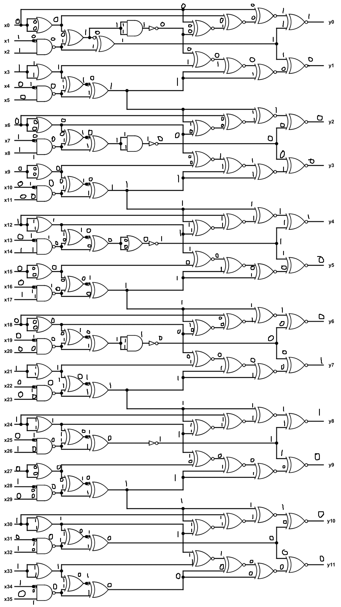
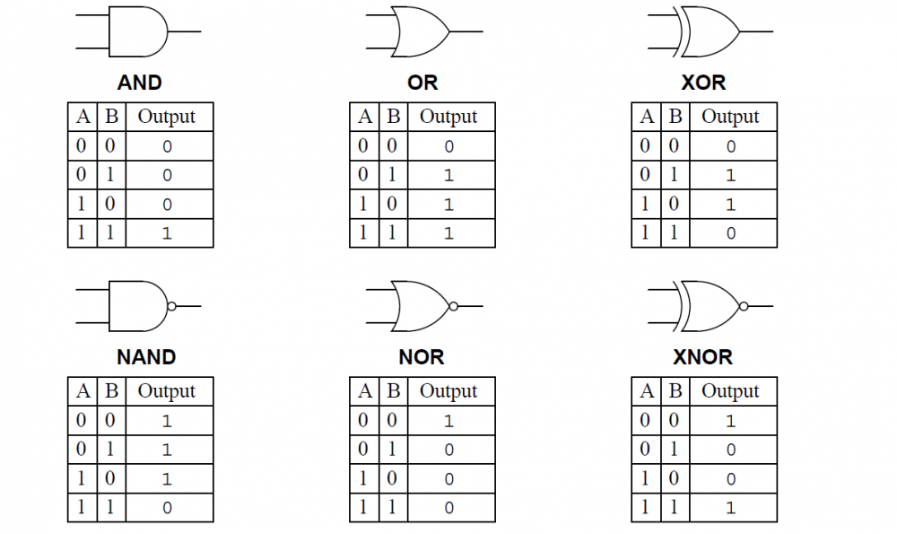
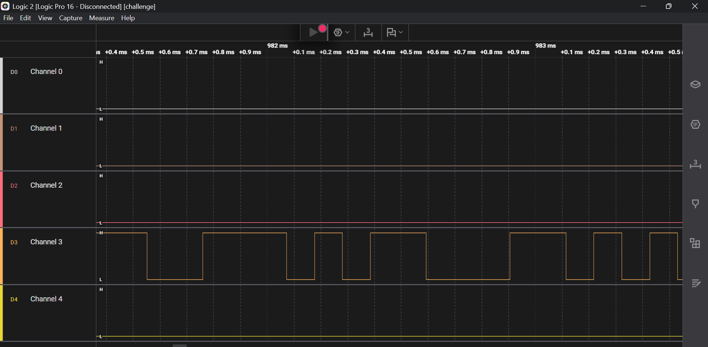
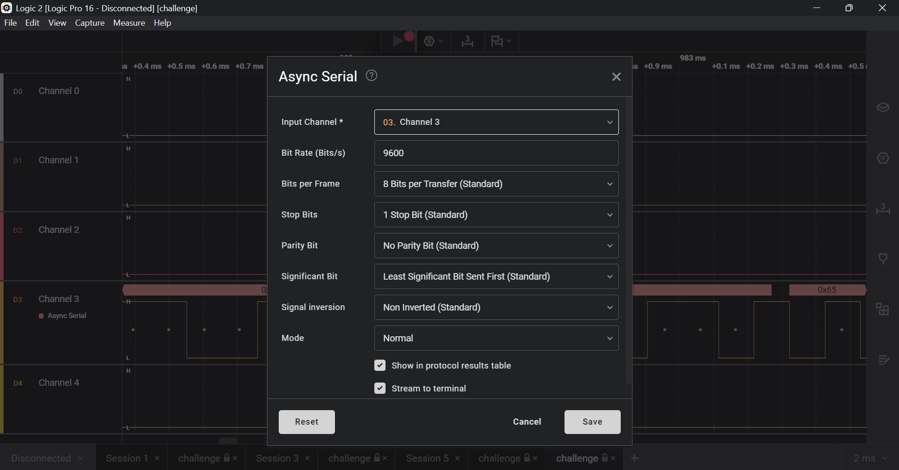
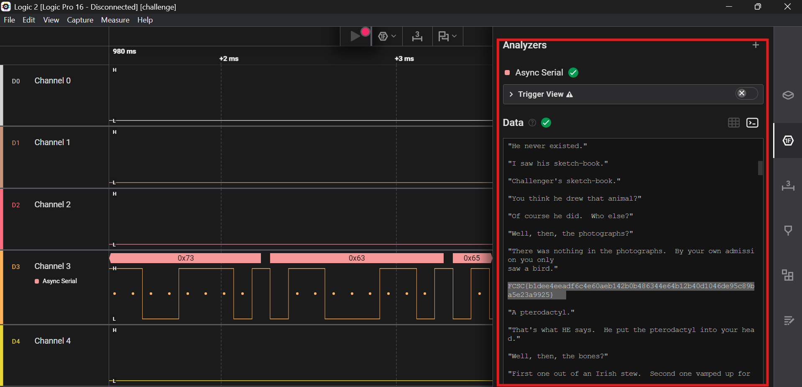

# 1.IQ Test

let your input x = 30478191278.

wrap your answer with nite{ } for the flag.

As an example, entering x = 34359738368 gives (y0, ..., y11), so the flag would be nite{010000000011}.

## Solution:
So I started off with downloading the folder.The challenge was a logic gates question , an input was given '30478191278' and the output had to be find out in the image:

The inputs ranged from x0 to x35, meaning there were 36 inputs in total. So first, I had to convert the given number into binary. For that, I used Python:
```
bin(30478191278)
'0b11100011000101001000100101010101110'
```

That meant my input sequence was 011100011000101001000100101010101110. These were the binary values that needed to be assigned to the inputs.

Next, I placed all these values at their respective inputs and began solving the logic gates. To do that, I used my basic knowledge of logic gates, their truth tables, and the Boolean expressions used to evaluate them, the main gates used in the circuit were:


 I opened the diagram in Paint and manually marked the inputs to evaluate each gate step by step using their truth tables:
 

After completing the circuit evaluation, I got my final outputs y0–y11 as:
100010011000

Hence, my final flag was:
nite{100010011000}

## Flag:

```
 nite{100010011000}
```

## Concepts learnt:
I got a hand on revision on logic gates and their truth tables,expressions.


## Incorrect Tangents

No major incorrect tangent as it was straightforward solving though time consuming as various times due to a lot of chaos all around I was getting confused whether I was evaluating the right outputs or not.

## Resources:

https://siit.co/blog/how-logic-gates-work-or-and-xor-nor-nand-xnor-and-not/2918

***

# 2. I like Logic

I like logic and I like files, apparently, they have something in common, what should my next step be.

## Solution:

So I started off by downloading the folder. When I opened it, I found a .sal file, and the description as well as the challenge name strongly hinted at a link between the logic and the file. I quickly googled what a .sal file was and how to work with it, and found out that it’s “a capture file from the Saleae Logic Analyzer,” which records signals for hardware analysis. So, I downloaded the Logic 2 software and opened the given file in it. I could see a square wave-like waveform on channel 3:

After seeing the waveform, it was quite evident that the .sal capture had only one active line that stayed high and dipped low — indicating it was an Async Serial signal(UART). So, I clicked on Add Analyzer, selected Async Serial, chose Channel 3 (which displayed the waveform), and then hit Save:

It displayed a data table, so I switched to the Terminal view from the data table, and it showed the text that was extracted after analyzing the signal:

I scrolled through the text and got my flag somewhere in the middle.

## Flag:

```
FCSC{b1dee4eeadf6c4e60aeb142b0b486344e64b12b40d1046de95c89ba5e23a9925}
```

## Concepts learnt:
1.What a UART serial communcation is, how does it work :
UART serial communication is a way of sending data one bit at a time between two devices using just two wires — one for sending (TX) and one for receiving (RX). It doesn’t use a clock signal; instead, both devices agree on a speed (baud rate) and use start and stop bits to mark where each piece of data begins and ends.


2.What is a .sal file and basics of how could LOGIC2 be used to analyze a file like that:
A .sal file is a file made by the Saleae Logic Analyzer that stores the captured signals or waveforms from electronic devices. It basically saves what the logic analyzer recorded so you can open and analyze it later in the Logic software.


## Incorrect Tangents
At first I  misunderstood the wave form 

When I first opened the waveform in Logic 2, I wasn’t sure if it was SPI or I2C because of the square-wave pattern, but after doing a bit of study I came to know how to spot the difference. Noticing there was only one active line I realized it had to be Async Serial (UART).

## Resources:

https://www.youtube.com/watch?v=IyGwvGzrqp8
https://exploit-notes.hdks.org/exploit/hardware/sal-logic-analysis/
https://www.saleae.com/pages/downloads

***

# 3. Bare Metal Alchemist

My friend recommended me this anime but i think i've heard a wrong name.


## Solution:
I started by downloading the folder. In it I found a .elf file — basically the Linux version of an .exe. I opened a terminal, went to the folder, made the file executable with
```
$ chmod a+x firmware.elf
```
and tried to run it with
```
./firmware.elf
```
but got:
```
bash: ./firmware.elf: cannot execute binary file: Exec format error
```
So it couldn't be executed. Out of curiosity I right-clicked the file and chose “Edit with Notepad.” All that showed was a mess of unreadable characters — total gibberish. That made it clear this wasn't a normal executable meant to run code; it looked like a data blob hiding something, which matched the challenge hint about something being “wrong with the name.” I also ran file and strings and opened it in a hex editor I had for previous challenges, but found nothing useful there either. That pushed the idea that the flag was hidden using a simple transform common in CTFs — things like Caesar shifts, ROTs, base64, or a single-byte XOR. XOR stood out because it is reversible with the same key and easy to test.
The workflow would be: take each byte of the file, XOR it with each possible key, and compare the result to a pattern that looks like a flag. To do that, I created a Python script in the same folder:
nano proper.py

and wrote:
```
import re
pattern = re.compile(rb"[A-Za-z0-9_]{1,30}\{[A-Za-z0-9_\-\+\=\/\\\.\s]{4,200}\}")
data = open("firmware.elf", "rb").read()
for key in range(1, 256):
    m = pattern.search(bytes(b ^ key for b in data))
    if m:
        print("This key matches:", key)
        print("Flag:", m.group().decode())
```
The code sets up a regex that looks for a flag-shaped string like NAME{...}. It reads the firmware file as binary into data, then tests every one-byte key from 1 to 255 by XORing all bytes with that key. Each XORed version is checked against the flag pattern(pattern.search), and if a match is found the key and the discovered flag are printed in readable form(m.group().decode())
I ran the script with:
```
$ python3 proper.py

and got:
This key matches: 9
Flag: mfVjelh{VkzzVz}
This key matches: 11
Flag: T{ydlyjf
              TT}
This key matches: 19
Flag: LL{vrcLv}
This key matches: 24
Flag: GG{lwjkG}
This key matches: 26
Flag: lh5{lh/5vsx}
This key matches: 30
Flag: Aqh{lxrqiA}
This key matches: 46
Flag: ojc{v.ojm.ojm}
This key matches: 52
Flag: 4kkqqdf{ykfqs}
This key matches: 56
Flag: yt8{tshj8kj}
This key matches: 57
Flag: 9mnxtk9mn{k9mnzk9mnjk9mn}
This key matches: 66
Flag: HBB{vBALxIyI
                  Q}
This key matches: 68
Flag: W{HFNDD}
This key matches: 71
Flag: TxKEMGG{sGDI}
This key matches: 107
Flag: mzjyjhcpcNcxnkkkjzk{mzjyjhcpcNcxnkkk}
This key matches: 109
Flag: hmmm{mmmom}
This key matches: 118
Flag: vv{BvuxL}
This key matches: 121
Flag: yy{yyyyy}
This key matches: 122
Flag: zzzzzzzzxuzzz{rymzzzx}
This key matches: 165
Flag: TFCCTF{Th1s_1s_som3_s1mpl3_4rdu1no_f1rmw4re}
```
The last result was the most meaningful and clearly the real flag.
## Flag:

```
TFCCTF{Th1s_1s_som3_s1mpl3_4rdu1no_f1rmw4re}
```

## Concepts learnt:
1.XOR KEY CIPHER:
An XOR key cipher hides data by flipping each bit or byte with a secret key using the XOR operation.
Apply the same key again and the original data is recovered.

2.REGEX MODULE:
The regex module helps find patterns or specific parts of text or data.
It can search, match, or extract things like words, numbers, or flags.
It saves time by checking patterns instead of each character one by one.


3.When a program tries every possible key or password until one works
It is simple and can be slow but it often succeeds if all options are tried
It is called brute force because it uses raw repeated guessing not technical processes.

## Incorrect Tangents
As already mentioned in the solution it took me a while before I could realize that this was not a good old executable file with a code behind the curtains but a file with some hidden data, everything I did between that cost me a lot of time, it included:
1. Trying executing the file itself
2. Opening the file with hex editor to find something meaningful
3. Worst of all I tried using gdb after getting excited to see an ELF file:
```
gdb firmware.elf
```
and then inside gdb using commands like info functions, disassemble main which are generally meant for Reverse engineering to just find a lot of non readable garbage.

## Resources:


https://youtu.be/UQQsYXa1EHs
