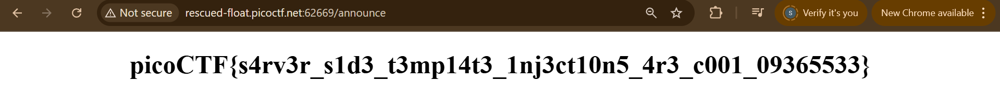
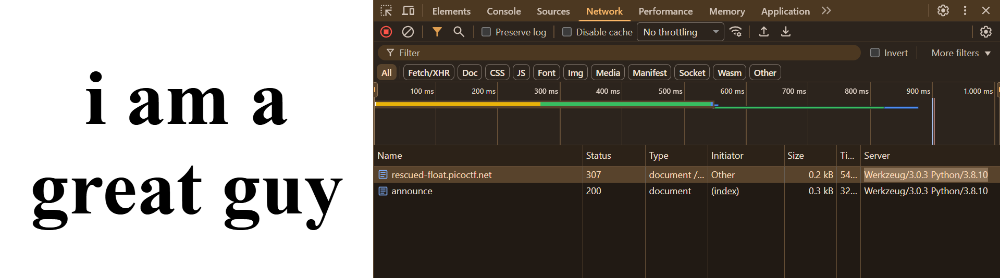
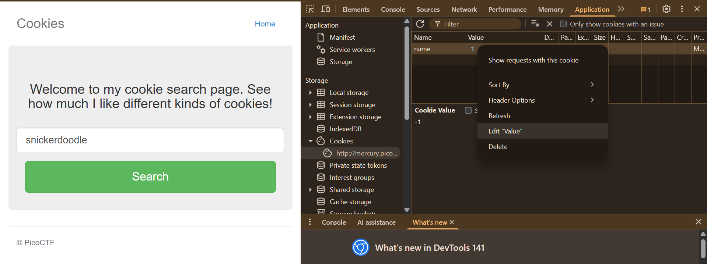
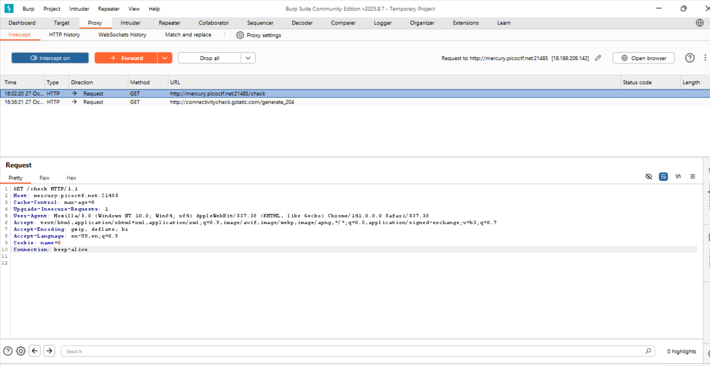
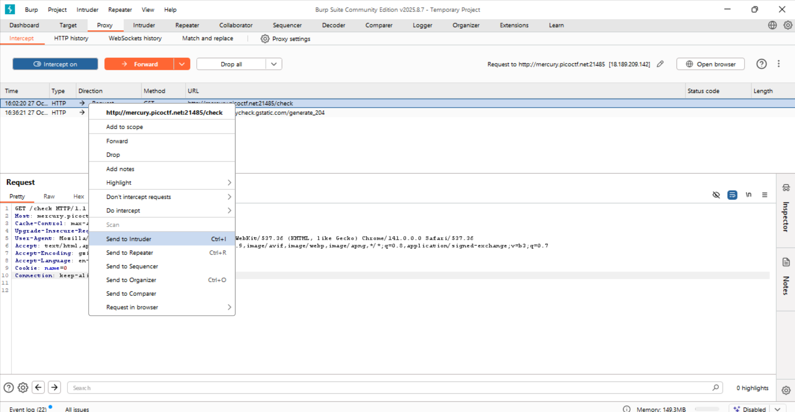
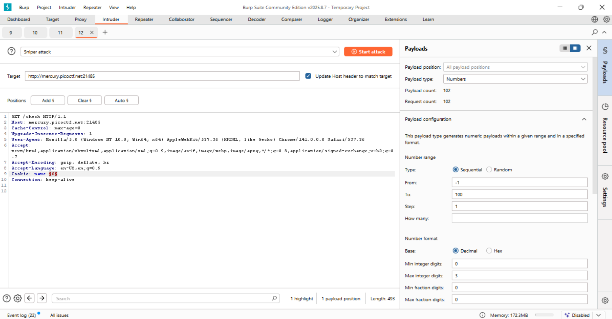

# 1.Web Gauntlet 

Can you beat the filters?
Log in as admin http://shape-facility.picoctf.net:53261/ http://shape-facility.picoctf.net:53261/filter.php

## Solution:
I started off by launching the instance and opening both links. On the first link I saw a page that asked for a username and password. The second page showed what I could not enter as input, basically the filter. At the start it showed or. I also read the hints for the challenge which pointed toward injections. So I learned a little about SQL injection and how it is used in hacking. (I used some youtube resources to understand it better) From the hints I knew I had to try an injection and the description said Log in as admin.

First I typed admin as both username and password. I did not clear the first round but I saw this on the screen:

```SELECT * FROM users WHERE username='admin' AND password='admin'```


Seeing that query helped a lot. It told me how the site was building SQL so I started thinking about ways to break out of the query. I already knew SQL statements can be ended with ; so I tried this input:

admin';


This input ends the username string early so the query becomes

```SELECT * FROM users WHERE username='admin';' AND password='any'```


Now the password check is irrelevant. That got me past round 2. I refreshed the filter page and saw the blocked tokens were or and like and -- but that did not stop me because I used ; to end the query rather than comment it. So admin'; still worked.

In round 3 the filter blocked or and = and like and > and < and -- but again my admin'; trick was fine. Then round 4 started and I could not use admin directly. I tried variants like ADMIN and Admin but those were also blocked. I realized I needed some way to produce the string admin without typing it directly.

I thought of string concatenation in SQL. If I input two pieces that the SQL engine joins into admin it would bypass the direct admin filter. So I tried this:

a'||'dmin';


That turned into the query

```SELECT * FROM users WHERE username='a'||'dmin';' AND password='any'```


which evaluates to admin in SQL. I refreshed the filter page again. This time the blocked tokens included or and = and like and > and < and -- and union and admin but I had not used union so that was fine. I used a'||'dmin'; again and advanced further.

Now in round 6 the page said "Checkout filter.php" so I refreshed the filter web page and the flag appeared.

## Flag:

```
 picoCTF{y0u_m4d3_1t_79a0ddc6}
```

## Concepts learnt:
I learned about sql injections and their practical use:
SQL injection is a hacking method where someone adds special commands or code into a website’s input box (like username or password) to trick the database into running those commands.


## Incorrect Tangents

1.Trying to directly log in as admin in round 1 without understanding the use of injections. 

2.Spending time on different variations of admin like ADMIN,Admin etc instead of finding a creative solution according to logic.

## Resources:

https://youtu.be/2OPVViV-GQk?si=b_vEqX6rRKjOoeCS


***

# 2. SSTI1

I made a cool website where you can announce whatever you want! Try it out!
Additional details will be available after launching your challenge instance.

## Solution:
I started by launching the instance and opening the link. There was a display box — the description said I could announce anything, so I simply wrote “I am a great guy” in the box and, as expected, the site printed “I am a great guy.” After that I read the hints; there was only one:
Server Side Template Injection. I searched YouTube to learn a little about it. From there I came across a common technique to check whether server-side template injections are possible: {{7*7}} should evaluate to 49 (double curly braces are used for server-side template injections). I input {{7*7}} in the display box and it printed 49.

To explore the page further I needed more than just knowing about curly braces — I wanted RCE (remote code execution). First I had to check what server the site was running on (Python, Node.js, etc.). I right-clicked, opened the developer tools, went to the Network tab, submitted “I am a great guy,” right-clicked the response in the Network tab, viewed the response headers, and saw the Server header showed Python:


Once I knew the server was Python I searched for “python server side template injection” (I had to search because I couldn’t know that automatically). I clicked the first result and found that RCE can be done by inputting:
```
{{request.application.__globals__.__builtins__.__import__('os').popen('id').read()}}
```


This printed:

uid=0(root) gid=0(root) groups=0(root)


Since the command was id, I changed it to ls to view the contents:
```
{{request.application.__globals__.__builtins__.__import__('os').popen('ls').read()}}
```


This output the directory contents, and I saw the flag file. I then changed the command to cat flag:

```
{{request.application.__globals__.__builtins__.__import__('os').popen('cat flag').read()}}
```
and this printed the flag:

## Flag:

```
picoCTF{s4rv3r_s1d3_t3mp14t3_1nj3ct10n5_4r3_c001_09365533}
```

## Concepts learnt:
I learnt what a server side template injection meant:
Server-side template injection (SSTI) is when an attacker puts malicious template code into a web app’s template input (like a form or comment) and the server renders that template without checking it first.


## Incorrect Tangents

The major incorrect tangents I went on was instead of realizing about RCE I kept wasting my time by typing different cmds like ls and cat directly inside of {{}}. Also before knowing that i could check the server engine from developer tools I was trying online sites to find out the server that also burnt many minutes.

## Resources:

https://www.youtube.com/watch?v=MebIE0ec6J8&t=766s
https://www.youtube.com/watch?v=SN6EVIG4c-0&t=336s

***

# 3.Cookies

Who doesn't love cookies? Try to figure out the best one. http://mercury.picoctf.net:21485/

## Solution:
Firstly, the title itself acted as a hint and told me this challenge was all about cookies. I opened the site and went to Developer Tools → Application → Cookies. I saw a value there that was set to -1. I searched the site (it had a search box) for snickerdoodle as the site instructed; when I got the result the value changed to 0. After that I tried editing it myself with different values — each time a different cookie value appeared on the screen:
 
I couldn’t try values forever, so I used Burp Suite (I learned how to use it from a short YouTube video). First I turned on the Interceptor, which intercepts and shows HTTP(S) requests and responses between your browser and the server so you can see what’s being sent. There I saw my cookie value:
 
I right-clicked and chose Send to Intruder:
 
Then I selected the cookie value as the payload position and started trying different values, from -1 up to 100, and launched the attack:
 
What I noticed was that at -1 the status code was 302 (redirect), and the same 302 occurred after 28. I went to the site and set the cookie to 29 — it displayed nothing — but at 28 it returned content. While analyzing the results, most Content-Length values were around 19xx, but the response for value 18 had length 1265. I changed the cookie to 18 and there was the flag.


## Flag:

```
picoCTF{3v3ry1_l0v3s_c00k135_94190c8a}
```

## Concepts learnt:
1.Learnt use of burp suite.
2.A cookie is a small piece of data that a website saves in your browser to remember information about you — like your login, preferences, or what’s in your shopping cart — for when you visit the site again basically making the site more efficient.


## Incorrect Tangents

The main incorrect tangent was trying to change the values manually though I eventually got the flag but still I learnt that for this kind of task the important thing is to use burp suite which is a widely used popular tool for web exploitation.

## Resources:

https://www.youtube.com/watch?v=r46b9L6UQDo